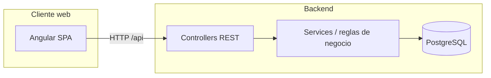

# BloomOps

Sistema de gestión operativa para una florería: pedidos programados, inventario floral, producción, despacho y entregas con confirmación de receptor.

Aplicación full stack con **Spring Boot** (API REST) y **Angular** (panel web).

---

## Características

| Módulo | Descripción |
|--------|-------------|
| **Registrar pedido** | Alta de pedidos con cliente, arreglo y fecha de entrega programada |
| **Validar inventario** | Comprueba stock de insumos antes de pasar a producción |
| **Programar producción** | Asigna florista y estima tiempos de elaboración |
| **Confirmar entrega** | Registro de entrega exitosa o fallida con receptor y firma |
| **Gestionar entregas** | CRUD de entregas (pendientes, confirmadas, rechazadas) |
| **Gestionar empleados** | Alta, edición y baja de personal por rol |
| **Scheduler** | Avance automático de pedidos en producción cuando vence el tiempo estimado |

Al iniciar con una base de datos vacía, el backend carga **datos de prueba** (empleados, insumos y un cliente) mediante `DataLoader`.

---

## Stack tecnológico

| Capa | Tecnología |
|------|------------|
| Backend | Java 21, Spring Boot 3.2, Spring Data JPA, Validation |
| Base de datos | PostgreSQL |
| Frontend | Angular 21, TypeScript, SCSS |
| Herramientas | Maven, npm |

---

## Arquitectura



### Flujo de estados del pedido

```
REGISTRADO → INVENTARIO_VALIDADO → EN_PRODUCCION → REVISION_CALIDAD → DESPACHADO → ENTREGADO
                                                                              ↘ CANCELADO
```

---

## Estructura del repositorio

```
BloomOps/
├── backend/                 # API REST (Spring Boot)
│   └── src/main/java/com/floreria/
│       ├── controller/      # Endpoints REST
│       ├── service/         # Lógica de negocio
│       ├── repository/      # Acceso a datos
│       ├── model/           # Entidades JPA
│       ├── dto/             # Objetos de transferencia
│       └── config/          # CORS, datos iniciales, scheduler
├── frontend/                # SPA Angular
│   └── src/app/
│       ├── core/            # API client, modelos, interceptor
│       └── features/        # Pantallas por flujo operativo
└── CRUD_ENTREGAS_DOCUMENTACION.md   # Detalle del módulo de entregas
```

---

## Requisitos previos

- **JDK 21**
- **Maven 3.8+**
- **Node.js 20+** y **npm**
- **PostgreSQL 14+** (base de datos creada y accesible)

---

## Configuración

El archivo `backend/src/main/resources/application.properties` **no se versiona** (contiene credenciales). Créalo a partir de este ejemplo:

```properties
# Servidor
server.port=8080

# PostgreSQL
spring.datasource.url=jdbc:postgresql://localhost:5432/bloomops
spring.datasource.username=tu_usuario
spring.datasource.password=tu_contraseña
spring.datasource.driver-class-name=org.postgresql.Driver

# JPA / Hibernate
spring.jpa.hibernate.ddl-auto=update
spring.jpa.show-sql=false
spring.jpa.properties.hibernate.dialect=org.hibernate.dialect.PostgreSQLDialect

# CORS (origen del frontend Angular)
cors.allowed-origins=http://localhost:4200

# Scheduler de producción (opcional, milisegundos; por defecto 60000)
scheduler.produccion.delay=60000
```

Crea la base de datos antes de arrancar el backend:

```sql
CREATE DATABASE bloomops;
```

---

## Puesta en marcha

### 1. Backend

```bash
cd backend
mvn spring-boot:run
```

La API queda disponible en `http://localhost:8080/api`.

### 2. Frontend

```bash
cd frontend
npm install
npm start
```

La aplicación web se sirve en `http://localhost:4200` y consume la API en el puerto **8080** (configurado en `frontend/src/app/core/api.service.ts`).

---

## API REST (resumen)

| Recurso | Base path | Operaciones principales |
|---------|-----------|-------------------------|
| Pedidos | `/api/pedidos` | CRUD de flujo: validar inventario, programar producción, aprobar despacho, confirmar entrega |
| Clientes | `/api/clientes` | Listar, obtener, crear |
| Empleados | `/api/empleados` | CRUD + disponibles por rol |
| Inventario | `/api/inventario` | Consulta y alertas de stock bajo |
| Entregas | `/api/entregas` | CRUD, confirmar, rechazar, filtros por estado |

Documentación ampliada del módulo de entregas: [CRUD_ENTREGAS_DOCUMENTACION.md](./CRUD_ENTREGAS_DOCUMENTACION.md).

---

## Pantallas del frontend

| Ruta | Función |
|------|---------|
| `/registrar-pedido` | Registro de nuevos pedidos |
| `/validar-inventario` | Validación de insumos |
| `/programar-produccion` | Asignación de producción |
| `/confirmar-entrega` | Cierre de entrega al cliente final |
| `/gestionar-entregas` | Administración del CRUD de entregas |
| `/gestionar-empleados` | Gestión de personal |

---

## Desarrollo

### Compilar el backend

```bash
cd backend
mvn clean package
```

### Build de producción del frontend

```bash
cd frontend
npm run build
```

Los artefactos se generan en `frontend/dist/`.

### Pruebas

```bash
# Backend
cd backend && mvn test

# Frontend
cd frontend && npm test
```

---

## Roles de empleado

- `RECEPCIONISTA`
- `FLORISTA`
- `DOMICILIARIO`
- `COORDINADOR`
- `AUXILIAR_PRODUCCION`

---

